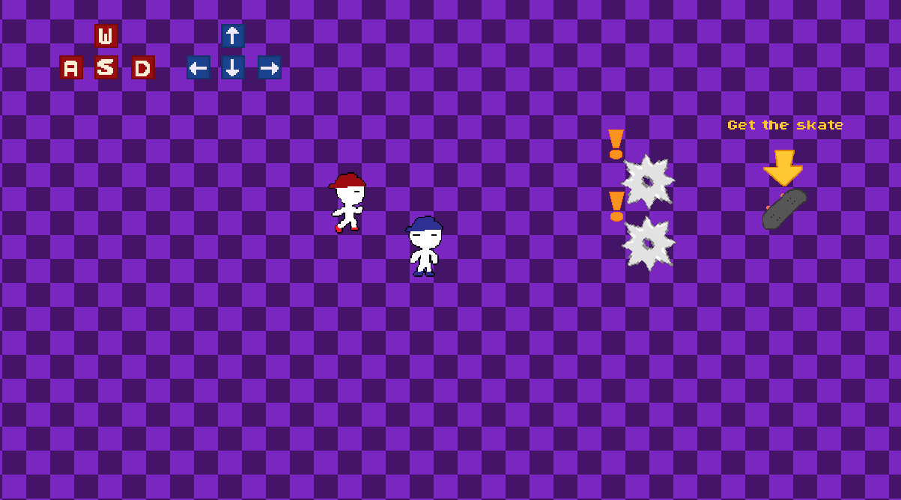
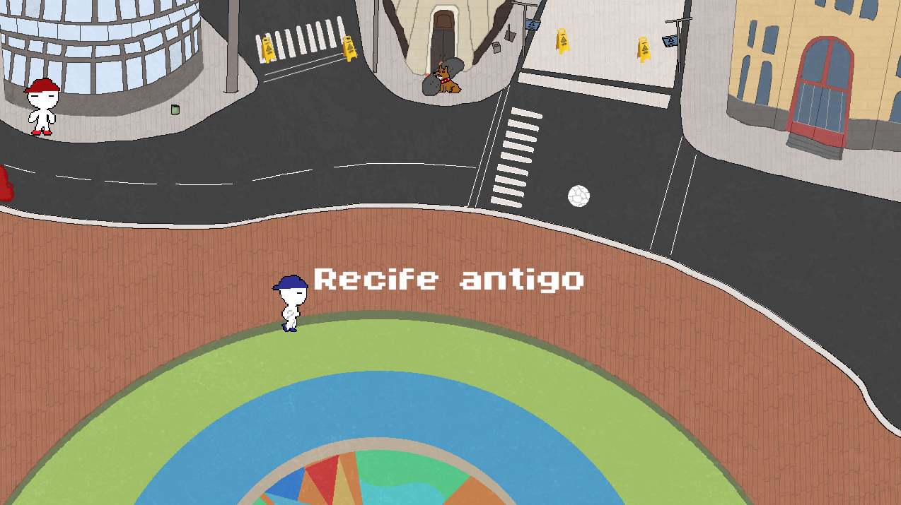
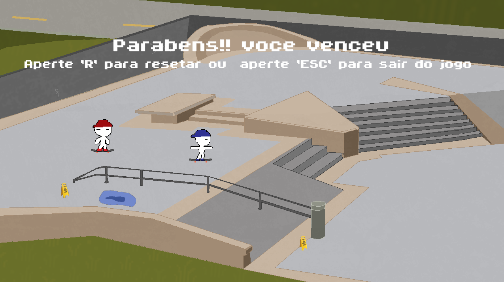

# Jogo 2D (GameMaker)

## Sobre o jogo
Jogo 2D desenvolvido no GameMaker, no qual os jogadores deve desviar de obstáculos e cooperar para coletar um skate para pontuar.

## Mecânicas
- Tutorial
- Movimentação dos personagens
- Sistema de colisão
- Sistema de pontuação
- Trocas de fases

## Objetivo
Desviar dos obstáculos e coletar o skate para avançar de fase.

## Imagens do jogo

## Tecnologias
- GameMaker
